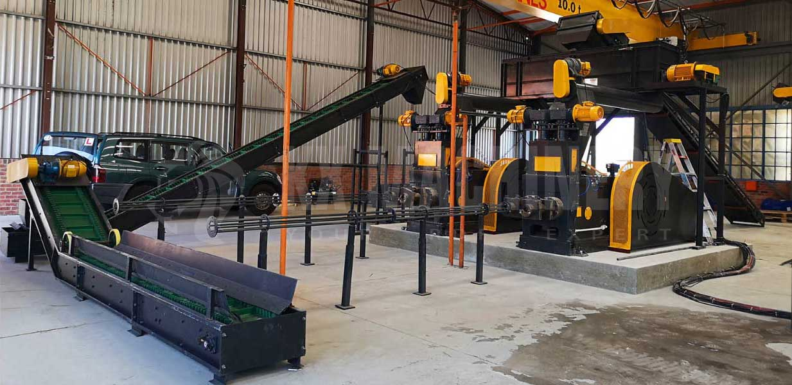

# Endustry Admin - Invoice & Weighing System



## Streamlining Industrial Operations

Endustry Admin is a comprehensive solution designed for industrial plants to efficiently manage invoices and weighing operations. Built with modern web technologies, this application provides a seamless experience for tracking truck weights, generating invoices, and managing customer data—all within an intuitive, user-friendly interface.

## Powerful Features

### Invoice Management
Transform your billing process with our robust invoice system that allows you to create, edit, and track invoices through their entire lifecycle. Generate professional PDF invoices with a single click and easily search through your records.

### Weight Ticket System
Connect directly to your weighing scales for real-time readings. Create weight tickets on the fly, associate them with invoices, and generate detailed documentation for your records and customers.

## Cutting-Edge Technology

Endustry Admin leverages the latest in web development:

- **Frontend**: Built on Next.js 14 with React 18, TypeScript, and TailwindCSS for a responsive and modern UI
- **Backend**: Powered by Next.js API Routes, Prisma ORM, and PostgreSQL for reliable data management
- **Real-time Updates**: Utilizing Socket.IO for instant data synchronization
- **Hardware Integration**: Seamlessly connects with Arduino-based weighing scales via serial communication

## Design Inspiration

The frontend design of Endustry Admin draws inspiration from the [Xora project](https://github.com/adrianhajdin/xora/tree/main), incorporating sleek UI elements and responsive design principles to create an intuitive industrial management interface. We've adapted these design patterns to specifically address the needs of manufacturing facilities and industrial plants.

## Key Benefits

- **Increased Efficiency**: Reduce manual paperwork by up to 80%
- **Error Reduction**: Minimize human error in weighing and invoicing processes
- **Real-time Insights**: Access critical business data instantly through comprehensive dashboards
- **Cost Savings**: Lower operational costs through streamlined processes and reduced waste
- **Enhanced Customer Experience**: Provide faster service and more accurate documentation


## Media Credits

- Landing page images: Photo by Monstera Production: https://www.pexels.com/photo/cutout-paper-of-man-examining-bills-through-magnifying-glass-5849566/
- Weighing load Photo by Tima Miroshnichenko: https://www.pexels.com/photo/a-man-and-a-woman-working-for-a-delivery-company-6169668/
- Customer Management Photo by Monstera Production: https://www.pexels.com/photo/person-with-bills-for-goods-or-services-5849565/
- Cashier Photo by: Kaboompics.com: https://www.pexels.com/photo/push-cart-and-a-white-paperbag-5632402/
- Hero Image by freepik: https://www.freepik.com/free-ai-image/person-using-ar-technology-their-daily-occupation_137499766.htm#fromView=search&page=1&position=41&uuid=467fb966-867b-4777-8f9f-e7b070385518&query=3d+image+industry+
- Icon Image by studiogstock on Freepik: https://www.freepik.com/free-vector/bundle-engineering-set-icons_5984949.htm#from_element=detail_alsolike


## Quick Setup
1. **Clone the repository**
   ```bash
   git clone https://github.com/lagooneration/endustry.git
   cd endustry
   ```

2. **Install dependencies**
   ```bash
   npm install
   # or
   yarn install
   ```

3. **Set up environment variables**
   ```bash
   cp .env.example .env.local
   ```
   Then edit `.env.local` with your database credentials and other configuration.

4. **Set up the database**
   ```bash
   npx prisma migrate dev
   ```

5. **Start the development server**
   ```bash
   npm run dev
   # or
   yarn dev
   ```

6. **Access the application**
   Open [http://localhost:3000](http://localhost:3000) in your browser.

## Hardware Setup (for weighing scale integration)

1. Connect your Arduino-based weighing scale to your server via USB
2. Ensure the correct serial port is configured in your environment variables
3. The system will automatically detect and communicate with the connected scale
